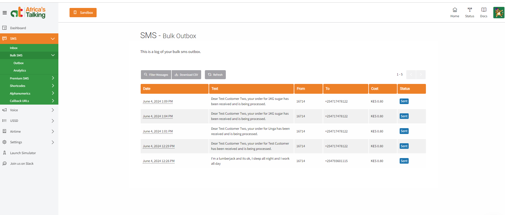
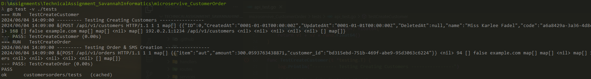
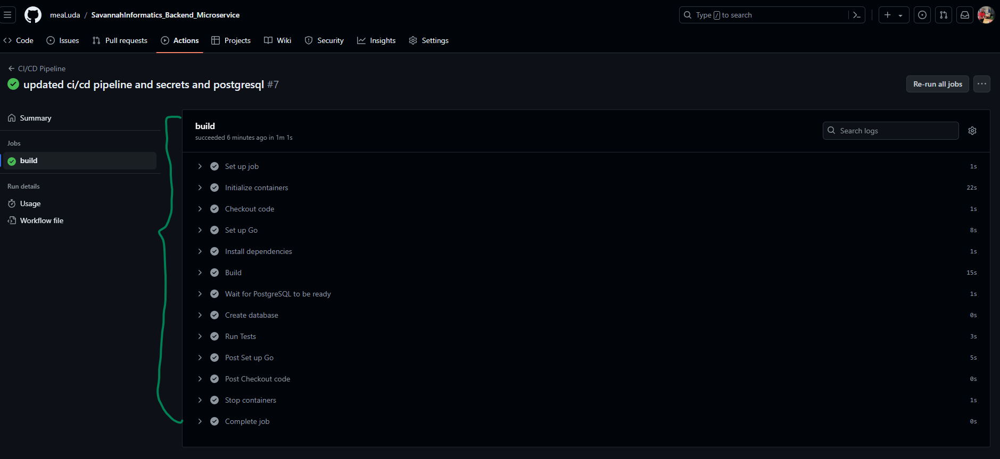

# Technical Assessment Interview Savannah Informatics


## Description
A simple service for managing customers and orders with REST API.

## Setup
1. Clone the repository.
2. Create a `.env` file and set the required environment variables.
3. Run `go mod tidy` && `go run main.go`.

## Endpoints
Running Locally: `localhost:8080` Running in Server `20.121.68.15:8080`
- POST `/api/v1/customers` - Create a new customer.

    Data Structure
    ```
    {   
        "name":"Jane Doe",
	    "code":"" // random code
    }
    ```

- POST `/api/v1/orders` - Create a new order.

    Data Structure
    ```
    {
        "item":"1KG sugar",
        "amount":459.66,
        "customer_id": "1"
    }
    ```
- SMS Dashboard



## Environment Variables Needed

* `NOTE`: if on `docker` and `windows` change `localhost` or `database host` to `host.docker.internal`
```
## ----------- database
DB_USER=
DB_PASSWORD=
DB_NAME=
DB_HOST=
DB_PORT=

## ----------- sms providers

AFRRICAS_TALKING_SANDBOX_API_KEY=
SHORT_CODE=16714
SMS_PROVIDER_USERNAME=
```

## Tests
Run `go test -v ./tests`

* Running Test



## CI/CD
Using GitHub Actions for CI.

